# Erst Technical Architecture

## Overview

**Erst** is a Soroban debugging and error decoding tool for the Stellar network. It bridges the gap between opaque XDR error codes and developer-friendly transaction analysis through transaction replay and local simulation.

The architecture consists of three core components:
1. **Go CLI** (`erst`): Command-line interface for user interaction
2. **RPC Client**: Stellar network data fetching via Horizon API and JSON-RPC
3. **Rust Simulator** (`erst-sim`): Soroban transaction execution and diagnostics

---

## System Architecture Diagram

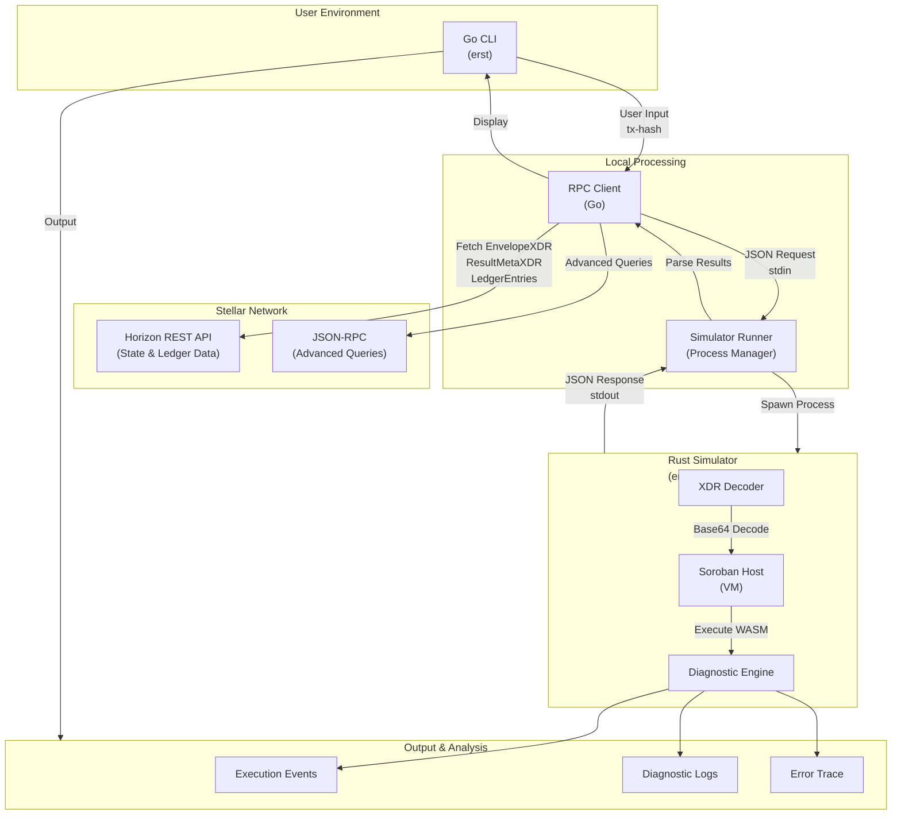

---

## Data Flow: Transaction Debugging Workflow

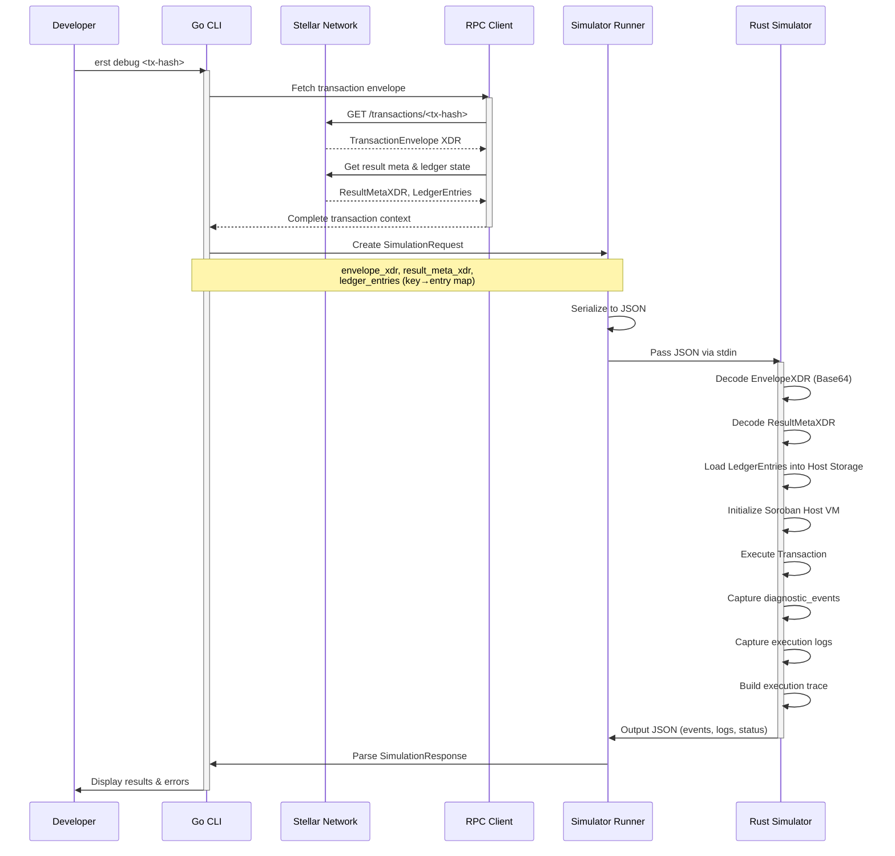

---

## IPC Protocol: Go ↔ Rust Communication

### Communication Method: stdin/stdout JSON Serialization

The Go CLI and Rust simulator communicate through a simple but effective protocol:

#### Request Format (Go → Rust)

```json
{
  "envelope_xdr": "base64-encoded-transaction-envelope",
  "result_meta_xdr": "base64-encoded-transaction-result-meta",
  "ledger_entries": {
    "base64-key-1": "base64-ledger-entry-1",
    "base64-key-2": "base64-ledger-entry-2"
  }
}
```

**Field Descriptions:**

| Field | Type | Purpose |
|-------|------|---------|
| `envelope_xdr` | String (Base64) | Complete signed transaction envelope ready for execution |
| `result_meta_xdr` | String (Base64) | Transaction result metadata from the blockchain (optional) |
| `ledger_entries` | Map (Base64 → Base64) | Read/write set of ledger entries at transaction time |

#### Response Format (Rust → Go)

```json
{
  "status": "success|error",
  "error": null or "error message",
  "events": ["event1", "event2"],
  "logs": ["log1", "log2"]
}
```

**Field Descriptions:**

| Field | Type | Purpose |
|-------|------|---------|
| `status` | String | Execution status: "success" or "error" |
| `error` | String \| Null | Error message if status is "error" |
| `events` | Array | Diagnostic events emitted during execution |
| `logs` | Array | Detailed execution logs for debugging |

### Process Flow

```mermaid
graph LR
    A["Go Client<br/>Serialize"] -->|stdin| B["Rust Process<br/>std input"]
    B -->|Deserialize| C["Parse JSON"]
    C -->|Validate| D["Prepare Simulation"]
    D -->|Execute| E["Run VM"]
    E -->|Collect| F["Events & Logs"]
    F -->|Serialize| G["Format JSON"]
    G -->|stdout| H["Go Client<br/>Receives"]
    H -->|Deserialize| I["Parse Results"]
    I -->|Display| J["User Output"]
    
    style A fill:#4A90E2
    style B fill:#E74C3C
    style I fill:#4A90E2
    style J fill:#2ECC71
```

---

## Component Details

### 1. Go RPC Client

**Location:** `internal/rpc/client.go`

**Responsibilities:**
- Establish connections to Stellar Horizon API
- Fetch transaction envelopes and metadata
- Query ledger state at specific transaction points
- Support multiple networks (Mainnet, Testnet, Futurenet)

**Key Functions:**

```go
// Client manages Stellar network interactions
type Client struct {
    Horizon horizonclient.ClientInterface
    Network Network
}

// NewClient creates network-specific RPC client
func NewClient(net Network) *Client

// Fetch transaction context
func (c *Client) GetTransaction(ctx context.Context, txHash string) (*TransactionResponse, error)

// Fetch ledger entries for simulation
func (c *Client) GetLedgerEntries(ctx context.Context, keys []string) (map[string]string, error)
```

**Network Support:**

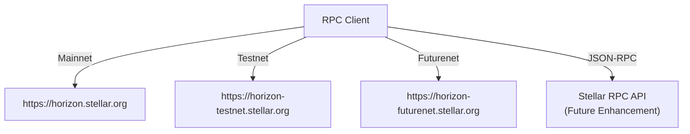

### 2. Simulator Runner

**Location:** `internal/simulator/runner.go`

**Responsibilities:**
- Locate and execute the `erst-sim` Rust binary
- Manage subprocess lifecycle
- Handle IPC communication via stdin/stdout
- Deserialize simulation results

**Key Functions:**

```go
// Runner manages simulator subprocess execution
type Runner struct {
    BinaryPath string
}

// NewRunner creates runner with binary discovery
func NewRunner() (*Runner, error)

// Run executes simulation with request
func (r *Runner) Run(req *SimulationRequest) (*SimulationResponse, error)
```

**Binary Discovery Priority:**

```
1. ERST_SIMULATOR_PATH environment variable
2. ./erst-sim (current working directory)
3. ./simulator/target/release/erst-sim (development)
4. erst-sim (global PATH)
```

### 3. Rust Simulator (erst-sim)

**Location:** `simulator/src/main.rs`

**Responsibilities:**
- Decode XDR structures from Base64
- Initialize Soroban Host VM with ledger state
- Execute transaction and capture diagnostics
- Generate execution trace and error information

**Execution Pipeline:**

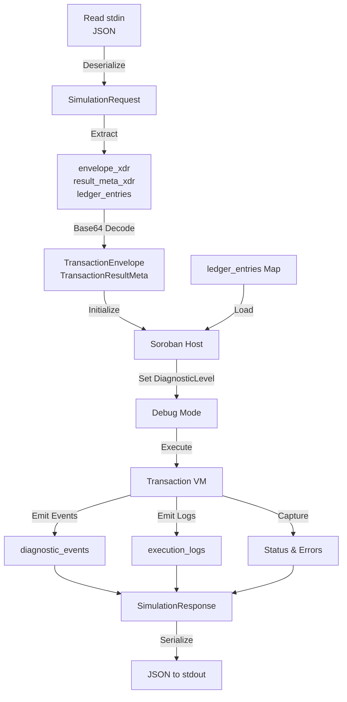

---

## JSON-RPC vs Horizon API Usage

### When to Use Horizon API

**Strengths:**
- ✅ Simple REST interface with standard HTTP
- ✅ Broad ecosystem support and documentation
- ✅ Well-established for common queries

**Use Cases in Erst:**
- Fetching transaction details and envelopes
- Querying account information
- Accessing transaction history

**Endpoints:**
- `GET /transactions/{id}` — Get transaction by hash
- `GET /ledger_entries` — Query ledger state
- `GET /accounts/{account}` — Account details

### When to Use JSON-RPC (Future Enhancement)

**Strengths:**
- ✅ More granular access to ledger state
- ✅ Better support for historical queries
- ✅ Optimized for simulator needs

**Planned Use Cases:**
- Direct ledger entry queries by key
- Snapshot state at specific ledger close time
- Reduced payload sizes with selective field queries

**Implementation Plan:**
```
Phase 1: Current — Horizon API (stable, mature)
Phase 2: Hybrid — JSON-RPC for ledger queries
Phase 3: Future — JSON-RPC as primary data source
```

---

## State Fetching & Management

### Ledger State Snapshot

When debugging a transaction, Erst must capture the exact ledger state at the point of execution:

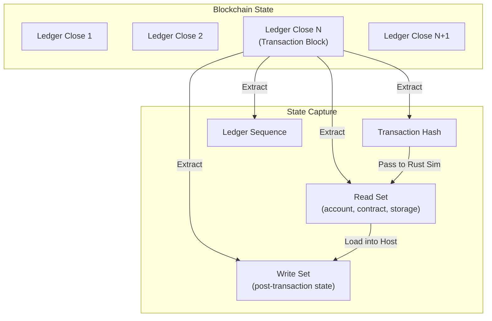

### State Consistency Requirements

| State Element | Source | Purpose |
|---------------|--------|---------|
| Account Balance | Horizon API | Verify sender has funds |
| Contract State | Ledger Entries | Execute contract logic |
| Sequence Numbers | Account Query | Validate transaction ordering |
| Fee Pool | Ledger Query | Calculate fee impacts |

---

## Event Correlation & Error Tracing

### Diagnostic Events Flow

The Soroban Host emits structured diagnostic events during execution. Erst correlates these with transaction failures:

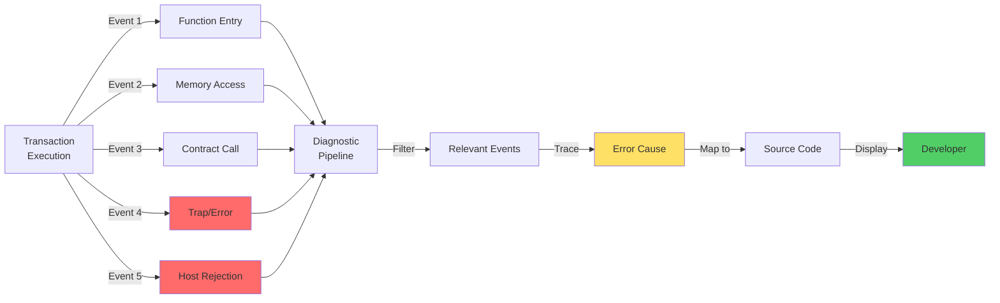

### Error Classification

```
┌─ Execution Errors
│  ├─ Trap/Panic
│  ├─ Assertion Failure
│  └─ Out of Bounds
│
├─ Logic Errors
│  ├─ Invalid State Transition
│  ├─ Permission Denied
│  └─ Contract Violation
│
├─ Resource Errors
│  ├─ Out of Gas
│  ├─ Memory Exceeded
│  └─ Instruction Limit
│
└─ Network Errors
   ├─ Invalid Signature
   ├─ Bad Sequence
   └─ Insufficient Balance
```

---

## Data Flow: Detailed Examples

### Example 1: Simple Contract Call

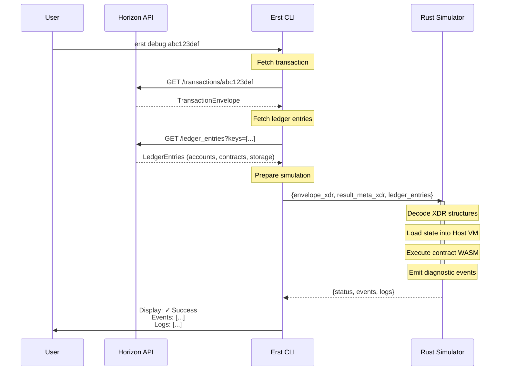

### Example 2: Failed Transaction with Error

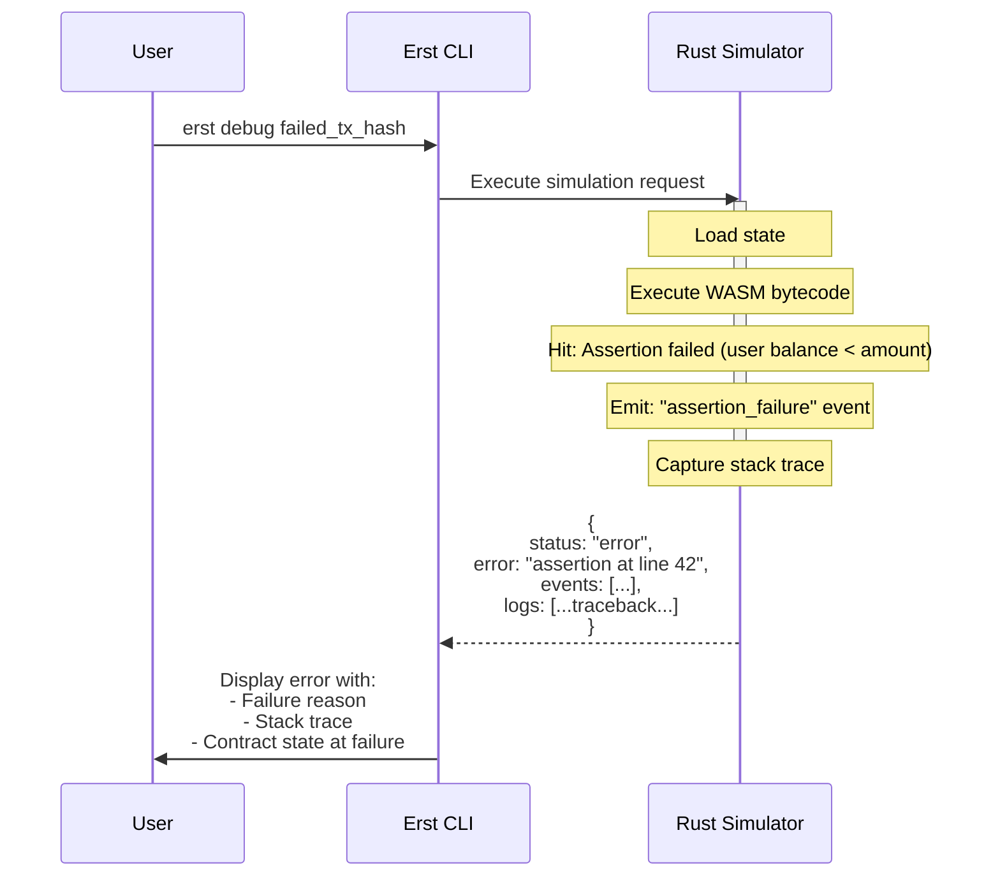

---

## Integration Points & Extensibility

### Current Integration Points

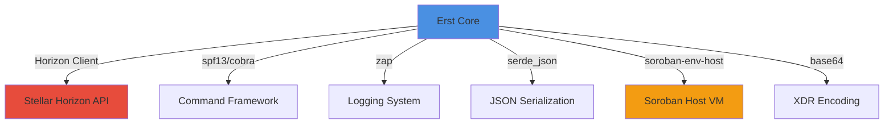

### Future Integration Points

| Component | Purpose | Status |
|-----------|---------|--------|
| JSON-RPC Client | Direct ledger queries | Planned |
| WebAssembly Inspector | WASM-level debugging | Proposed |
| Source Map Integration | Map to Rust source | Phase 3 |
| Event Database | Persistent event logging | Future |
| Dashboard/Web UI | Visual debugging interface | Backlog |

---

## Performance Considerations

### Optimization Strategies

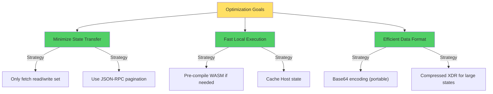

### Benchmarking Metrics

- **State Fetch Time**: Horizon latency + payload size
- **Simulation Time**: WASM execution + event collection
- **Memory Usage**: Host VM state + ledger cache
- **End-to-End**: User request → result display

---

## Development Setup

### Building the Project

```bash
# Clone and navigate
git clone https://github.com/dotandev/hintents.git
cd hintents

# Build Rust simulator
cd simulator
cargo build --release
cd ..

# Build Go CLI
go build -o erst ./cmd/erst

# Run tests
go test ./...
```

### Environment Variables

```bash
# Simulator binary location (optional)
export ERST_SIMULATOR_PATH=/path/to/erst-sim

# Network selection
export STELLAR_NETWORK=testnet  # or mainnet, futurenet
```

---

## Testing Architecture

### Unit Testing

- **RPC Client Tests**: Mock Horizon API responses
- **Runner Tests**: Test subprocess execution and IPC
- **Serialization Tests**: Validate JSON encoding/decoding

### Integration Testing

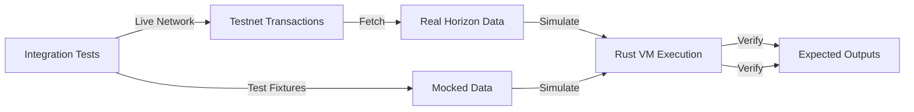

---

## Troubleshooting Guide

### Common Issues

| Issue | Cause | Solution |
|-------|-------|----------|
| `erst-sim not found` | Binary not built or incorrect path | Run `cargo build --release` in simulator/ |
| `Invalid JSON` from simulator | Malformed request | Check XDR encoding is Base64-valid |
| `Ledger entry decode error` | Incorrect ledger state snapshot | Verify transaction block number |
| `Horizon API timeout` | Network latency or endpoint down | Use `--network futurenet` or check Horizon status |

---

## Future Enhancements

1. **Phase 2**: Source-level debugging with line mapping
2. **Phase 3**: Web dashboard for visual inspection
3. **Phase 4**: Machine learning for error pattern detection
4. **Phase 5**: Integration with IDEs and development tools

---

## Contributing

For architecture questions or to propose changes, see [CONTRIBUTING.md](../CONTRIBUTING.md).
# Architecture

Erst follows a split-architecture design to leverage the best tools for each job:
1.  **Go CLI (`cmd/erst`)**: Provides a user-friendly interface, handles networking (Horizon RPC), and manages the user experience.
2.  **Rust Simulator (`simulator/`)**: Uses `soroban-env-host` to replay transactions with high fidelity.

## Inter-Process Communication (IPC)

The core validation and debugging logic happens in the Rust simulator. Since `soroban-env-host` is a Rust library, we wrap it in a standalone binary (`erst-sim`) and communicate with it from the Go CLI via standard input/output (Stdin/Stdout).

### Data Flow

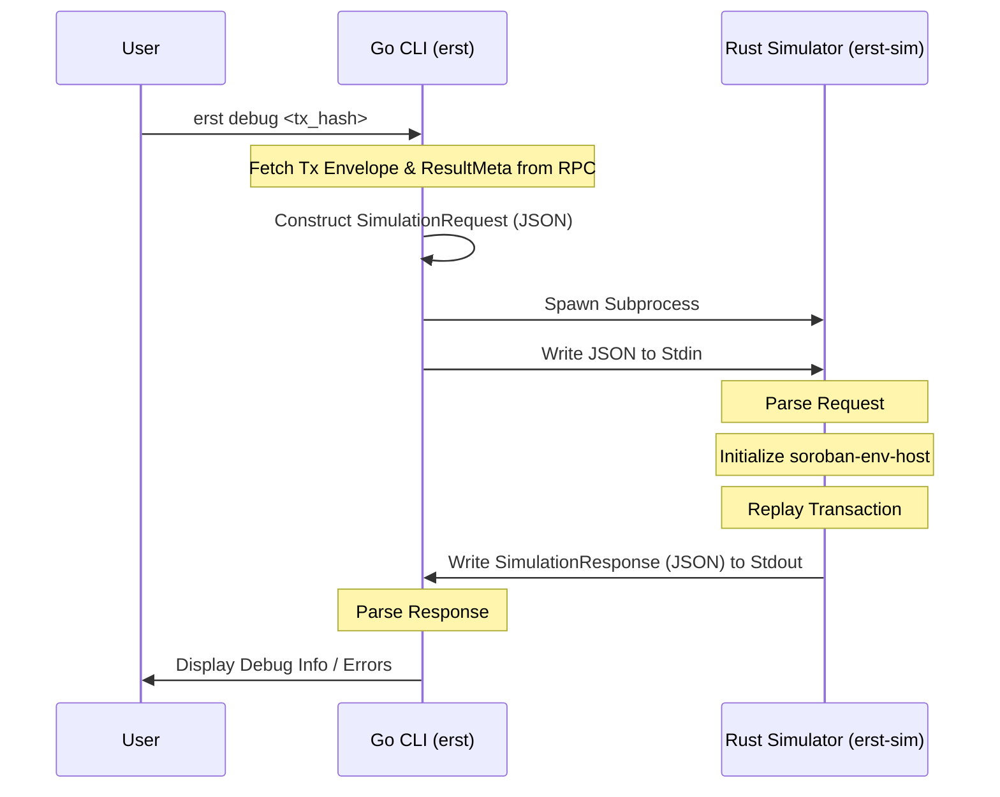

### JSON Protocol

#### Request (Go -> Rust)

The Go CLI sends a JSON object containing the XDR envelopes required to reconstruct the transaction state.

```json
{
  "envelope_xdr": "AAAA...",
  "result_meta_xdr": "AAAA...",
  "ledger_entries": {
    "key_xdr_1": "entry_xdr_1"
  }
}
```

#### Response (Rust -> Go)

The Rust simulator returns a JSON object with the execution status, logs, and any events captured during the replay.

```json
{
  "status": "success",
  "error": null,
  "events": ["Contract Event 1", "Diagnostic Event 2"],
  "logs": ["Host Initialized", "Charged 100 fee"]
}
```
