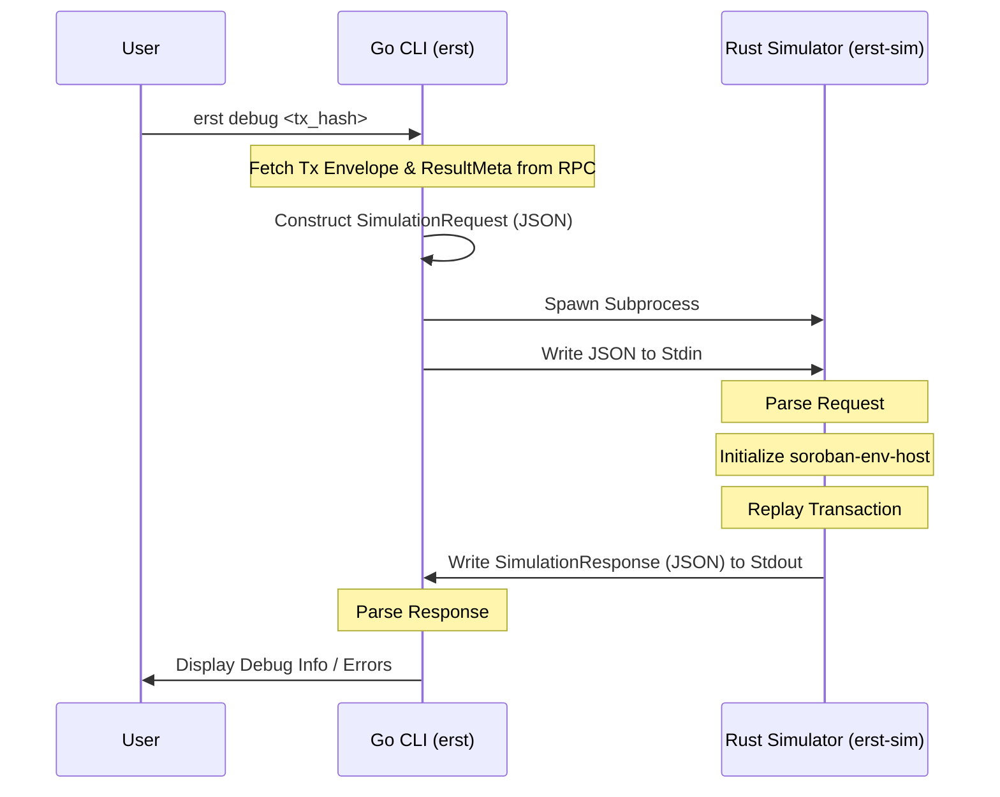

# Architecture

Erst follows a split-architecture design to leverage the best tools for each job:
1.  **Go CLI (`cmd/erst`)**: Provides a user-friendly interface, handles networking (Horizon RPC), and manages the user experience.
2.  **Rust Simulator (`simulator/`)**: Uses `soroban-env-host` to replay transactions with high fidelity.

## Inter-Process Communication (IPC)

The core validation and debugging logic happens in the Rust simulator. Since `soroban-env-host` is a Rust library, we wrap it in a standalone binary (`erst-sim`) and communicate with it from the Go CLI via standard input/output (Stdin/Stdout).

### Data Flow



### JSON Protocol

#### Request (Go -> Rust)

The Go CLI sends a JSON object containing the XDR envelopes required to reconstruct the transaction state.

```json
{
  "envelope_xdr": "AAAA...",
  "result_meta_xdr": "AAAA...",
  "ledger_entries": {
    "key_xdr_1": "entry_xdr_1"
  }
}
```

#### Response (Rust -> Go)

The Rust simulator returns a JSON object with the execution status, logs, and any events captured during the replay.

```json
{
  "status": "success",
  "error": null,
  "events": ["Contract Event 1", "Diagnostic Event 2"],
  "logs": ["Host Initialized", "Charged 100 fee"]
}
```
