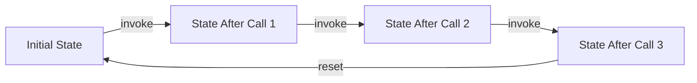
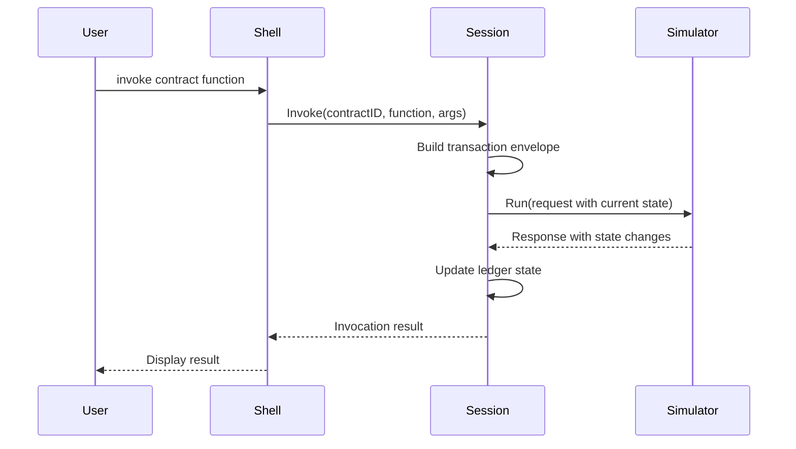

# Interactive Shell

## Overview

The Erst interactive shell provides a persistent REPL (Read-Eval-Print Loop) environment for testing Soroban smart contracts. Unlike one-off transaction debugging, the shell maintains ledger state across multiple invocations, enabling complex multi-step contract testing scenarios.

## Features

- **Persistent Ledger State**: State changes from one invocation carry over to the next
- **Multi-Step Testing**: Test complex workflows involving multiple contract calls
- **State Management**: Save, load, and reset ledger state
- **Interactive REPL**: Command-line interface with history and auto-completion
- **Network Integration**: Fetch initial state from Stellar networks

## Getting Started

### Basic Usage

Start the shell with default settings:

```bash
erst shell
```

Start on a specific network:

```bash
erst shell --network testnet
```

Start with initial state from a file:

```bash
erst shell --init-state my-state.json
```

## Shell Commands

### invoke

Invoke a contract function with arguments.

**Syntax:**
```
invoke <contract-id> <function> [args...]
```

**Example:**
```
erst> invoke CAAAA... transfer alice bob 100
Invoking CAAAA....transfer(alice, bob, 100)...

Result:
  Status: success
  Events: 1
    [0] Transfer: alice -> bob (100)
  Logs: 2
    [0] Balance updated: alice
    [1] Balance updated: bob
```

### state

Display or manage ledger state.

**Display current state:**
```
erst> state

Current Ledger State:
  Entries: 42
  Sequence: 15
  Timestamp: 1735689600
  Invocations: 7
```

**Save state to file:**
```
erst> state save my-checkpoint.json
State saved to my-checkpoint.json
```

**Load state from file:**
```
erst> state load my-checkpoint.json
State loaded from my-checkpoint.json
```

**Reset to initial state:**
```
erst> state reset
State reset to initial state
```

### help

Display available commands and usage information.

```
erst> help
```

### clear

Clear the terminal screen.

```
erst> clear
```

### exit / quit

Exit the shell.

```
erst> exit
Goodbye!
```

## Use Cases

### Multi-Step Token Transfer

Test a series of token transfers:

```bash
erst> invoke TOKEN_CONTRACT transfer alice bob 100
erst> invoke TOKEN_CONTRACT transfer bob charlie 50
erst> invoke TOKEN_CONTRACT balance charlie
```

### Complex DeFi Workflow

Test a complete DeFi interaction:

```bash
# Approve spending
erst> invoke TOKEN_CONTRACT approve alice DEX_CONTRACT 1000

# Add liquidity
erst> invoke DEX_CONTRACT add_liquidity alice TOKEN_A TOKEN_B 500 500

# Perform swap
erst> invoke DEX_CONTRACT swap alice TOKEN_A TOKEN_B 100

# Check balances
erst> invoke TOKEN_A balance alice
erst> invoke TOKEN_B balance alice
```

### State Checkpointing

Save state at key points for testing different scenarios:

```bash
# Set up initial state
erst> invoke TOKEN_CONTRACT mint alice 1000
erst> state save initial.json

# Test scenario A
erst> invoke TOKEN_CONTRACT transfer alice bob 500
erst> state save scenario_a.json

# Reset and test scenario B
erst> state load initial.json
erst> invoke TOKEN_CONTRACT transfer alice charlie 500
erst> state save scenario_b.json
```

## State File Format

State files are JSON documents containing ledger entries and metadata:

```json
{
  "entries": {
    "base64_key_1": "base64_value_1",
    "base64_key_2": "base64_value_2"
  },
  "ledger_sequence": 42,
  "timestamp": 1735689600
}
```

## Architecture

### Session Management

The shell maintains a `Session` object that tracks:
- Current ledger entries (key-value map)
- Ledger sequence number
- Timestamp
- Invocation count
- Initial state for reset

### State Persistence

State changes are tracked across invocations:



### Invocation Flow



## Implementation Status

### Current Features

- [OK] Interactive REPL with command parsing
- [OK] State management (save/load/reset)
- [OK] Session tracking
- [OK] State summary display
- [OK] Network integration

### Planned Features

- ⏳ XDR envelope building for invocations
- ⏳ State extraction from simulation results
- ⏳ Command history and auto-completion
- ⏳ Contract address book
- ⏳ Batch command execution from files
- ⏳ State diff visualization
- ⏳ Transaction replay from history

## Limitations

### Current Limitations

1. **Envelope Building**: Contract invocation envelope building requires stellar-sdk integration
2. **State Extraction**: Automatic state extraction from ResultMetaXDR not yet implemented
3. **Argument Parsing**: Complex argument types require manual XDR encoding

### Workarounds

For now, you can:
- Use the shell for state management and tracking
- Manually build transaction envelopes
- Use `erst debug` for individual transaction testing

## Examples

### Example 1: Token Testing

```bash
$ erst shell --network testnet

erst> # Initialize token
erst> invoke TOKEN_CONTRACT initialize admin 1000000

erst> # Mint tokens
erst> invoke TOKEN_CONTRACT mint alice 1000
erst> invoke TOKEN_CONTRACT mint bob 500

erst> # Save checkpoint
erst> state save tokens_minted.json

erst> # Test transfers
erst> invoke TOKEN_CONTRACT transfer alice bob 100
erst> invoke TOKEN_CONTRACT transfer bob charlie 50

erst> # Check final state
erst> state

erst> # Reset and try different scenario
erst> state load tokens_minted.json
erst> invoke TOKEN_CONTRACT transfer alice charlie 200
```

### Example 2: Multi-Contract Interaction

```bash
$ erst shell --network testnet --init-state deployed.json

erst> # Approve DEX to spend tokens
erst> invoke TOKEN_A approve alice DEX_CONTRACT 1000
erst> invoke TOKEN_B approve alice DEX_CONTRACT 1000

erst> # Add liquidity
erst> invoke DEX_CONTRACT add_liquidity alice TOKEN_A TOKEN_B 500 500

erst> # Save liquidity state
erst> state save liquidity_added.json

erst> # Perform swaps
erst> invoke DEX_CONTRACT swap alice TOKEN_A TOKEN_B 100
erst> invoke DEX_CONTRACT swap bob TOKEN_B TOKEN_A 50

erst> # Check pool state
erst> invoke DEX_CONTRACT get_reserves TOKEN_A TOKEN_B
```

## Troubleshooting

### Shell Won't Start

**Problem**: `erst-sim binary not found`

**Solution**: Build the simulator:
```bash
cd simulator
cargo build --release
```

### State Not Persisting

**Problem**: State changes not visible between invocations

**Solution**: Ensure invocations complete successfully. Check for errors in the output.

### Invalid State File

**Problem**: `failed to load state: invalid JSON`

**Solution**: Verify the state file is valid JSON. Use `state save` to create valid state files.

## Best Practices

1. **Save Checkpoints**: Save state before risky operations
2. **Use Descriptive Names**: Name state files clearly (e.g., `after_deployment.json`)
3. **Test Incrementally**: Build up complex scenarios step by step
4. **Reset Often**: Use `state reset` to start fresh when needed
5. **Document Workflows**: Keep notes on successful test sequences

## Future Enhancements

- **Script Mode**: Execute commands from a file
- **State Diff**: Show changes between states
- **Contract Registry**: Manage contract addresses
- **Argument Templates**: Reusable argument patterns
- **Transaction History**: Review and replay past invocations
- **State Visualization**: Graphical state browser
- **Multi-User Sessions**: Collaborative testing

## Contributing

To contribute to the interactive shell:

1. Implement XDR envelope building in `internal/shell/session.go`
2. Add state extraction from ResultMetaXDR
3. Improve command parsing and validation
4. Add more shell commands
5. Enhance error messages and help text

See [CONTRIBUTING.md](CONTRIBUTING.md) for guidelines.
