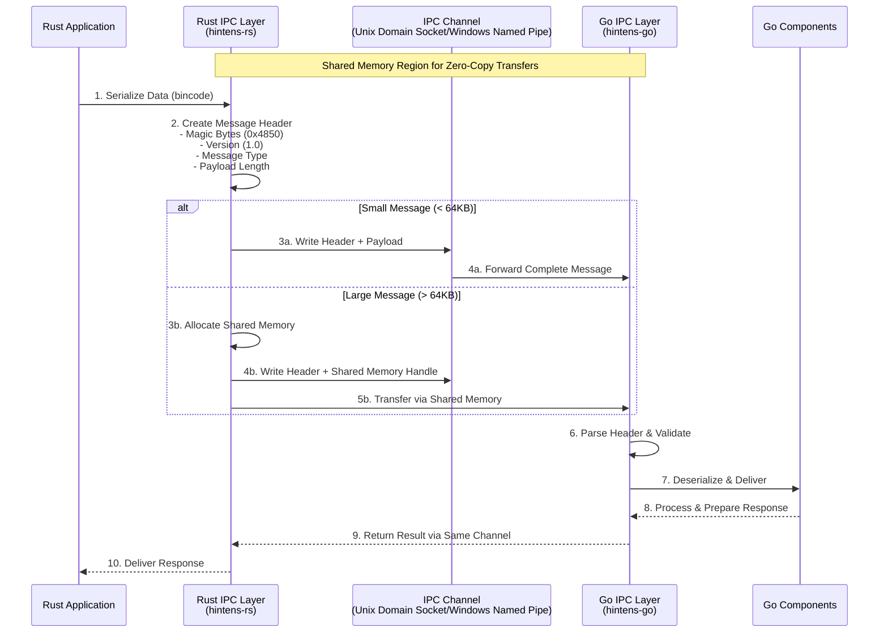
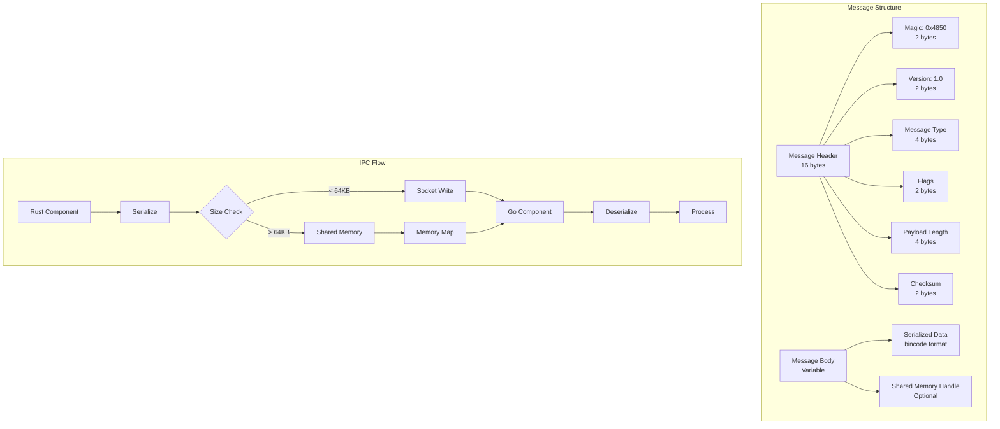

# Hintens

[](https://github.com/dotandev/hintens/actions)
[](https://docs.rs/hintens)
[](https://pkg.go.dev/github.com/dotandev/hintens-go)

Hintens is a hybrid Rust-Go system that combines Rust's performance with Go's concurrency model through efficient IPC.

## Architecture

### IPC Layer Communication

The diagram below illustrates how Rust and Go components communicate through the IPC layer:



### Message Structure



## Protocol Details

### Message Header Format

| Field | Size | Description |
|-------|------|-------------|
| Magic | 2 bytes | Protocol identifier (0x4850 = "HP") |
| Version | 2 bytes | Protocol version (0x0100 = v1.0) |
| Message Type | 4 bytes | Request (1), Response (2), Event (3), Error (4) |
| Flags | 2 bytes | SHM flag, Compression flag, etc. |
| Payload Length | 4 bytes | Size of payload in bytes |
| Checksum | 2 bytes | CRC16 of payload |
| Request ID | 8 bytes | Unique request identifier |

### Transport Mechanisms

- **Small Messages** (<64KB): Direct socket transfer
- **Large Messages** (≥64KB): Shared memory with handle passing

## Implementation Examples

### Rust Client
```rust
use hintens::IPCClient;

#[tokio::main]
async fn main() -> Result<(), Box<dyn std::error::Error>> {
    let client = IPCClient::connect("/tmp/hintens.sock").await?;
    
    // Send small message
    let response: String = client
        .send("Hello from Rust!")
        .await?;
    
    // Send large data via shared memory
    let large_data = vec![0u8; 1024 * 1024]; // 1MB
    let result: Vec<u8> = client
        .send(large_data)
        .await?;
    
    Ok(())
}
```

### Go Client
```go
package main

import (
    "github.com/dotandev/hintens-go/ipc"
)

func main() {
    client, err := ipc.NewClient("/tmp/hintens.sock")
    if err != nil {
        panic(err)
    }
    defer client.Close()
    
    // Send small message
    response, err := client.Send([]byte("Hello from Go!"))
    if err != nil {
        panic(err)
    }
    
    // Send large data
    largeData := make([]byte, 1024*1024) // 1MB
    result, err := client.Send(largeData)
}
```

## Performance Considerations

- Zero-copy transfers for payloads >64KB using shared memory
- Connection pooling for high-throughput scenarios
- Automatic batching of small messages
- Configurable timeouts and retry policies

## Development

### Building from Source
```bash
# Clone the repository
git clone https://github.com/dotandev/hintens.git
cd hintens

# Build Rust components
cargo build --release

# Build Go components
cd go && go build ./...
```

### Running Tests
```bash
# Run Rust tests
cargo test

# Run Go tests
cd go && go test ./...

# Run integration tests
cargo test --test ipc_integration
```

## Contributing

Please read [CONTRIBUTING.md](CONTRIBUTING.md) for details on our code of conduct and the process for submitting pull requests.

## License

This project is licensed under the MIT License - see the [LICENSE](LICENSE) file for details.